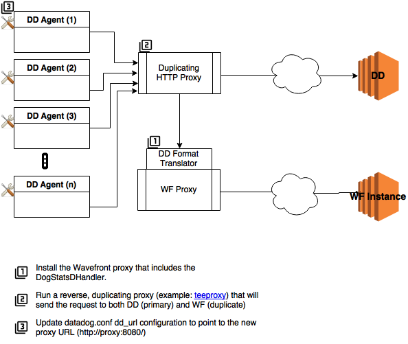

# Overview
The Wavefront proxy accepts data in a number of formats.  One of those formats is the JSON format created by the DataDog agent as well as the DogStatsD format.  This document outlines the how the Wavefront proxy can be configured to accept metrics coming from the DataDog agent or DogStatsD programs.

# Configuration Options
## Send metrics to Wavefront only


## Send metrics to both DataDog and Wavefront



# Install and Run Wavefront Proxy
1. Install the Wavefront proxy with this command line:

```$ sudo bash -c "$(curl -sL https://goo.gl/c70QCx)"```
Follow the prompts to install the proxy on the box you are setting up.  Your Wavefront URL is in the form of: https://{instance name}.wavefront.com/api/.  The API token can be obtained from the bottom of this page: https://{instance name}.wavefront.com/settings/profile.

2. (Optional) If you are running the Wavefront proxy on the same machine as you are running the DataDog agent, then you’ll need to add/update 2 configuration options. 
```
$ sudo vi /opt/wavefront/wavefront-proxy/conf/wavefront.conf
```
Add (to the bottom of the file):
```
dogstatsdPorts=9125
datadogPorts=9126
```

3. (Re)start the Wavefront Proxy
```
$ sudo service wavefront-proxy restart
```

# (Optional) Install a HTTP duplicator (to send to both DataDog and to Wavefront).  
*If you would like to send your data to both DataDog and Wavefront during your PoC, please complete the steps in this section.  If you are not sending your metrics to both servers, then you can skip this section.*

1. We’ve tested internally with teeproxy (an open source Go script), but there are other solutions out there.  teeproxy is available from https://github.com/chrislusf/teeproxy.  

```
$ git clone https://github.com/chrislusf/teeproxy.git
$ cd teeproxy; go build
```
The teeproxy has this usage:
```
./teeproxy -debug=true -l :<listening port> -a <dd_host_port> -b <wf_agent_host_port>
```
An example:
```
$ ./teeproxy -l :<PORT TO LISTEN ON> -a <host and port currently set in dd_url> -b <Wavefront proxy host>:8126
(Example: ./teeproxy -l :8090 -a localhost:8087 -b localhost:8126)
```

The results from server “b” are ignored and the results server “a” will be returned to the DD agent.  The Wavefront proxy is listening on port 8126 for DataDog agent requests.
***NOTE:** If you added the 2 configuration items in step #3 in previous section, then you’ll need to change this to port 9126 (or whatever port you entered in the configuration file).*


# Update DataDog Agent Configuration

1. Update the **dd_url** in the **datadog.conf** configuration file to point to one of:
* the teeproxy listener (in the example above it’s http://localhost:{PORT TO LISTEN ON})
* the Wavefront proxy (the default is http://localhost:8126)

2. Restart the DataDog supervisor/agent process.
3. Test to make sure everything is working.


